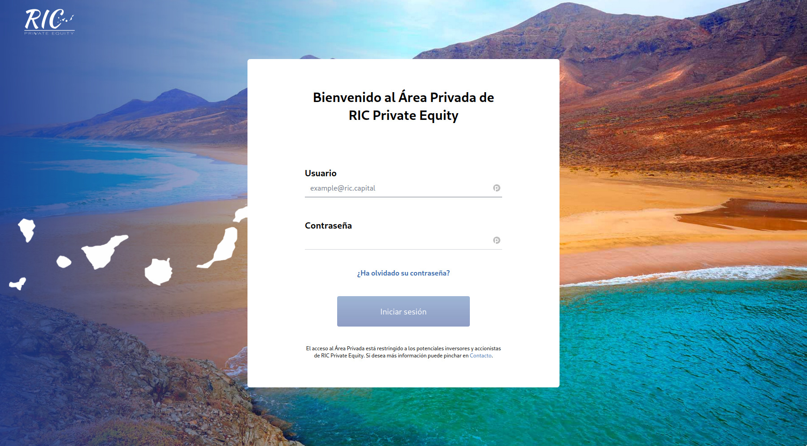

## Abstract
RICPE Private Area is an application that allows lead investors to reserve capital.

The application reduced complexity by giving a complete and easy workflow to invest on RICPE. Some task that allows the platform:

- Complete workflow to invest on RICPE.
- Self managable investor profile.
- Keep track of the status of inversions.
- Revisions from administrators for any change on the investors information.
- Generation of legal documents.

